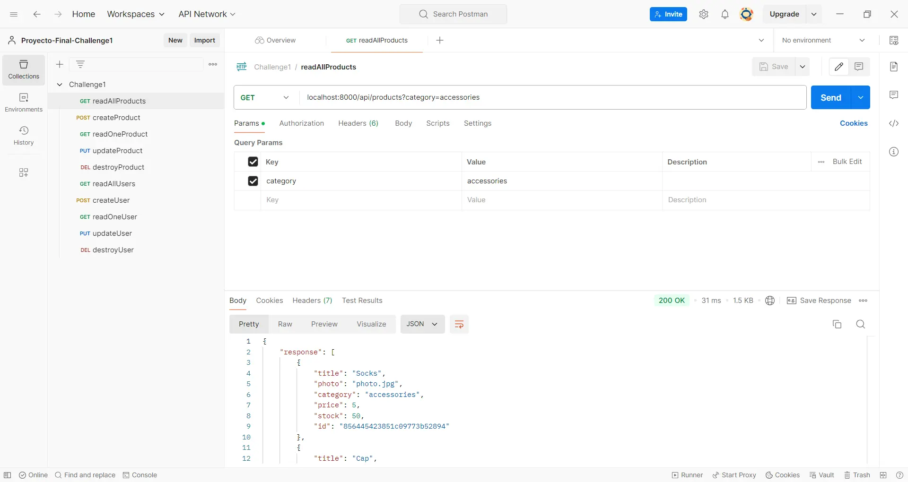

# BACKEND I - CODERHOUSE - COMISIÓN 70260
Alumno: [Federico Palorma](https://www.linkedin.com/in/federico-palorma-dev/)
## PROYECTO FINAL - CHALLENGE 1
### Iniciar el proyecto
Para ejecutar el proyecto en tu dispositivo local:

 - Clonar el repositorio
 - Abrirlo en el editor de código
 - Asegurarse de estar en la rama challenge1
 - Instalar paquetes de node `npm i` (instalará express, nodemon, morgan, entre otros módulos de Node.js)
 - Para correr el proyecto `npm run dev`
 
 ### Estructura
 El proyecto está distribuido en un archivo principal que se encuentra en la raíz llamado server.js. Aquí está definido el servidor que correrá en el puerto 8000.
 Dentro de la carpeta ./src se distribuye el contenido de la siguiente manera:
 
 - controllers: Aquí se encuentran los archivos products.controller.js y user.controller.js que proveerán la lógica necesaria para leer, escribir, modificar o eliminar recursos.
 - data: En data se encuentra la subcarpeta "fs" que almacena products.json y users.json. Además se encuentran products.manager.js y users.manager.js que contienen la clase formadora de cada "manejador".
 - middleware: Aquí se almacenan los middlewares creados para diferentes funciones como el manejo de errores, la validación de datos y el manejo de rutas.
 - routers: La lógica de enrutamiento de la aplicación se encuentra aquí. Se definió un enrutador principal que llama a sub-routers específicos para el manejo de los productos y los usuarios.

### Products
Los productos siguen el siguiente esquema:
{
"title": "Backpack", (Obligatorio)
"photo": "photo.jpg", (En caso de no definirse se cargará por defecto)
"category": "accessories", (En caso de no definirse se cargará por defecto)
"price": 35,(En caso de no definirse se cargará por defecto)
"stock": 12,(En caso de no definirse se cargará por defecto)
"id": "f160d59b5fc40ff2e16a0fd2"
}
### Users
Los usuarios siguien el siguiente esquema:
{
"email": "fede@gmail.com", (Obligatorio)
"password": "123456", (Obligatorio)
"photo": "user.jpg", (En caso de no definirse se cargará por defecto)
"role": 0, (En caso de no definirse se cargará por defecto)
"id": "d9021ddf5a2efd09cf441b6c"
}
### Postman y métodos

#### Products
GET /localhost:8000/api/products 

Este endpoint permite leer todos los productos. Si no hay productos se devuelve un error 404. Además, con el parámetro *?category=accessories* se pueden filtrar los productos por categoría.

GET /localhost:8000/api/products/:pid

Este endpoint toma como parámetro el ID del producto y lo retorna. Si el producto no existe, devuelve 404.

POST /localhost:8000/api/products

Este endpoint recibirá un JSON en su body y creará un producto. Se deben respetar los requerimientos mínimos de creación, sino se retorna error 400.
Los atributos que no son obligatorios se crearán con un valor por defecto en caso de no ser especificados.

PUT /localhost:8000/api/products/:pid

En este endpoint se pasa el ID del producto a modificar por parámetro y en el body se detalla, en formato JSON, los valores a modificar.

DELETE /localhost:8000/api/products/:pid

En este endpoint se pasa por parámetro el ID del producto. Si el producto se encuentra, es eliminado del array. Si no se encuentra, se devuelve un 404.

#### Users
GET /localhost:8000/api/users

Este endpoint permite leer todos los usuarios. Si no hay usuarios se devuelve un error 404. Además, con el parámetro *?role=0* se pueden filtrar los usuarios según su rol.

GET localhost:8000/api/users/:uid

Este endpoint toma como parámetro el ID del usuario y lo retorna. Si el usuario no existe, devuelve 404.

POST /localhost:8000/api/users

Este endpoint recibirá un JSON en su body y creará un usuario. Se deben respetar los requerimientos mínimos de creación, sino se retorna error 400.
Los atributos que no son obligatorios se crearán con un valor por defecto en caso de no ser especificados.

PUT /localhost:8000/api/users/:uid

En este endpoint se pasa el ID del usuario a modificar por parámetro y en el body se detalla, en formato JSON, los valores a modificar.

DELETE /localhost:8000/api/users/:uid

En este endpoint se pasa por parámetro el ID del usuario. Si el usuario se encuentra, es eliminado del array. Si no se encuentra, se devuelve un 404.
